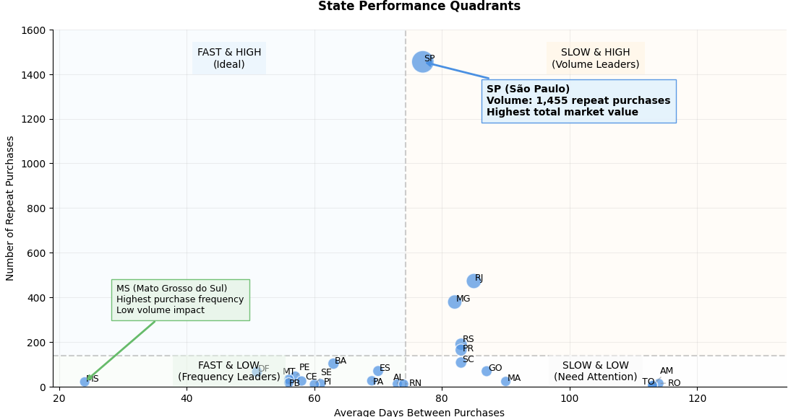
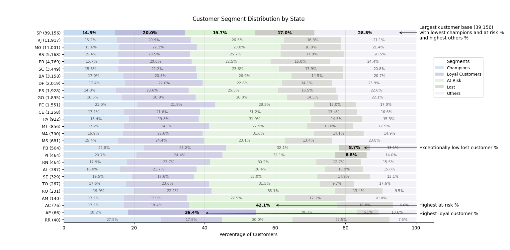
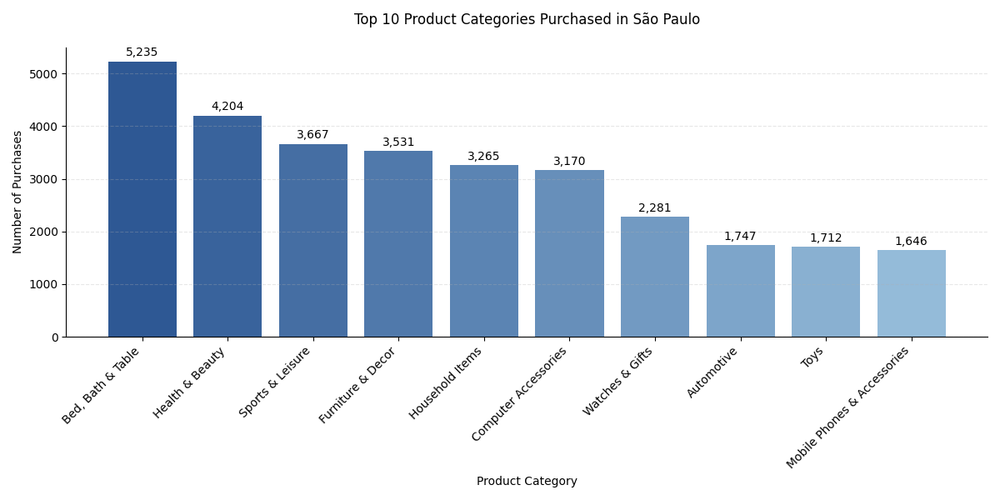
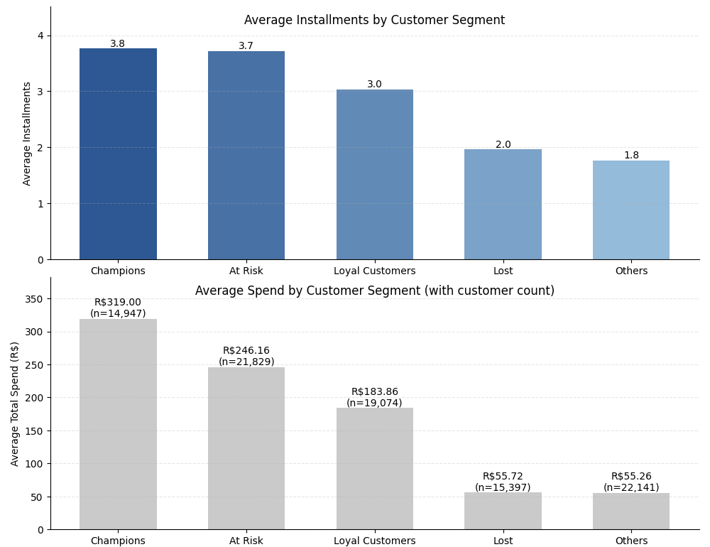

# E-commerce Market Analysis: Brazil's Olist Marketplace
**Strategic Insights for New Sellers**

## Table of Contents
- [E-commerce Market Analysis: Brazil's Olist Marketplace](#e-commerce-market-analysis-brazils-olist-marketplace)
  - [Table of Contents](#table-of-contents)
  - [Executive Summary](#executive-summary)
  - [Introduction](#introduction)
  - [Data Overview](#data-overview)
  - [Geographic Market Analysis](#geographic-market-analysis)
    - [Market Concentration and Opportunity](#market-concentration-and-opportunity)
    - [Regional Customer Behavior](#regional-customer-behavior)
  - [Customer Behavior Analysis](#customer-behavior-analysis)
    - [Customer Segmentation](#customer-segmentation)
  - [Product Category Analysis](#product-category-analysis)
  - [Payment and Financial Patterns](#payment-and-financial-patterns)
    - [Installment Analysis](#installment-analysis)
  - [Strategic Recommendations](#strategic-recommendations)
  - [Conclusion](#conclusion)
  - [Appendix: Advanced SQL Analysis](#appendix-advanced-sql-analysis)
    - [1. RFM Analysis with Customer Segmentation](#1-rfm-analysis-with-customer-segmentation)
    - [2. Purchase Frequency Analysis](#2-purchase-frequency-analysis)
    - [3. Installment Pattern Analysis](#3-installment-pattern-analysis)
  - [Contact](#contact)

## Executive Summary

Key Findings:
- São Paulo (SP) dominates with 17.39% of repeat customers and highest total revenue
- "Bed, Bath & Table" category shows strongest performance, followed by "Health & Beauty"
- Customer segmentation reveals opportunity in payment plan optimization
- Geographic analysis suggests focused market entry strategy
- Payment pattern analysis identifies early warning signals for customer churn

## Introduction

For entrepreneurs looking to enter Brazil's e-commerce market, Olist presents a compelling opportunity. Similar to Amazon's marketplace in the United States, Olist serves as Brazil's leading e-commerce marketplace platform, connecting small businesses to customers across the country. This analysis examines Olist's 2017-2018 marketplace data to develop an evidence-based market entry strategy for new sellers.

The Brazilian e-commerce landscape differs significantly from mature markets like the United States. With unique payment preferences, diverse regional markets, and distinct consumer behaviors, success requires careful analysis and strategic planning. This report aims to identify the most promising market segments, optimal product categories, and effective customer retention strategies for new sellers entering the Olist marketplace.

## Data Overview

The analysis draws from Olist's comprehensive marketplace data, encompassing:
- 99,442 customer records
- 96,097 unique customers
- 28 states
- 4,120 cities
- 96,477 delivered orders (97.02% delivery success rate)

Our dataset includes detailed customer information, order history, payment patterns, and product categories, allowing for deep insights into market behavior and opportunities. Customer tracking utilizes both transaction-specific IDs (customer_id) and persistent customer identifiers (customer_unique_id), enabling robust analysis of long-term customer behavior while maintaining transaction-level granularity.

The database schema can be found in the project's [src/schema.sql](src/schema.sql) file.

## Geographic Market Analysis

### Market Concentration and Opportunity

Our analysis reveals a clear hierarchy in market opportunity across Brazil's regions, with significant concentration in key urban centers. São Paulo emerges as the dominant market:



*Figure 1: State Performance Analysis showing purchase frequency vs. volume*

Key insights:
- São Paulo accounts for 1,455 repeat purchases, demonstrating exceptional market depth
- Five states (SP, RJ, MG, RS, PR) show high volume but slower purchase frequency
- Thirteen states show high purchase frequency but lower volume, indicating growth potential
- Six states require significant attention or strategic de-prioritization

### Regional Customer Behavior

Analysis of repeat purchase patterns reveals distinct regional characteristics:

Volume vs. Frequency Trade-off:
- SP has 1,455 repeat purchases with slightly below-average frequency
- MS has only 21 repeat purchases, even though they happen more frequently
- In terms of actual revenue generation, the sheer volume of SP's transactions (1,455) far outweighs any advantage from MS's higher purchase frequency

Business Impact:
- Even if MS customers buy more frequently, having only 21 repeat purchases means:
  - Limited total revenue potential
  - Small customer base to work with
  - Minimal impact on overall business performance
- SP's 1,455 repeat purchases means:
  - Much larger total revenue
  - Bigger customer base for marketing/growth
  - Significant impact on business performance

Growth Potential:
- SP's slightly below-average purchase frequency could actually be viewed as an opportunity:
  - Large existing customer base (shown by high volume)
  - Potential to increase purchase frequency through targeted marketing
  - Even a small improvement in frequency could have a large impact due to the volume

## Customer Behavior Analysis

### Customer Segmentation

Using RFM (Recency, Frequency, Monetary) analysis, we identified five distinct customer segments:



*Figure 2: Customer segment distribution across states*

Segment Characteristics:
1. Champions: Recently Active, Highly Engaged, Top Spenders
2. Loyal Customers: Consistently Active, Above-Average Value
3. At Risk: Previously Active, Recently Inactive
4. Lost: Long-Term Inactive
5. Others: Mixed Patterns (24.1% of customer base)

State-specific insights:
- São Paulo shows lowest Champions percentage but also lowest At-Risk rate, indicating remarkable stability
- Paraíba (PB) and Piauí (PI) demonstrate exceptional customer retention with low Lost customer rates (8.7% and 8.8%)
- Amapá (AP) leads in Loyal Customer percentage at 36.4%

## Product Category Analysis

Analysis of São Paulo's market reveals clear category preferences:



*Figure 3: Top-performing product categories in São Paulo*

Key findings:
1. "Bed, Bath & Table" dominates the market
   - Includes bedding, towels, table linens
   - Consistent demand patterns
   - High repeat purchase rate

2. "Health & Beauty" shows strong performance
   - Personal care items
   - Cosmetics and skincare
   - Regular replenishment patterns

3. Category concentration
   - Top two categories show significant volume advantage
   - Clear market preference for home and personal care items

## Payment and Financial Patterns

### Installment Analysis

Customer payment preferences reveal crucial behavioral insights:



*Figure 4: Installment usage across customer segments*

Key findings:
- Champions average 3.8 installments per purchase
- At-Risk customers show high installment usage (3.7), suggesting potential financial overextension
- Loyal Customers maintain moderate installment usage (3.0), indicating sustainable purchasing patterns
- High installment usage in At-Risk segment suggests a warning signal for customer churn

Critical insight: The similar installment usage between Champions (3.8) and At-Risk customers (3.7) suggests that At-Risk customers might be stretching their finances to maintain purchase levels similar to Champions, but without the same financial stability. This pattern often precedes customer churn and provides an opportunity for early intervention.

## Strategic Recommendations

1. Market Entry Strategy
   - Primary focus on São Paulo market
   - Initial concentration on "Bed, Bath & Table" category
   - Controlled expansion into "Health & Beauty" and "Sports & Leisure" after establishing market presence
   - Build infrastructure for installment payment processing

2. Customer Retention Strategy
   - Implement early warning system based on installment usage patterns
   - Develop segment-specific marketing approaches
   - Create loyalty programs rewarding consistent purchasing
   - Monitor payment behavior for signs of financial stress

3. Geographic Expansion Strategy
   - Establish strong presence in São Paulo before expansion
   - Target high-frequency states for secondary market development
   - Customize approach based on regional payment preferences

## Conclusion

This analysis reveals clear strategic priorities for entering Brazil's e-commerce market through Olist. The data strongly supports a focused approach: beginning with São Paulo's market, concentrating on the "Bed, Bath & Table" category, and implementing sophisticated customer retention strategies.

The findings demonstrate the importance of understanding regional variations in customer behavior and payment preferences. Success in this market requires balancing geographic focus with product specialization while maintaining flexibility in payment options.

For entrepreneurs entering this market, the path to success involves:
- Geographic focus on São Paulo's proven market
- Product concentration in the leading "Bed, Bath & Table" category
- Sophisticated approach to payment terms and customer retention
- Data-driven decision making for expansion timing

This strategic approach, backed by comprehensive data analysis, provides a robust framework for successful market entry and sustainable growth in Brazil's e-commerce sector.


## Appendix: Advanced SQL Analysis

Our analysis leveraged complex SQL techniques to extract meaningful insights. Below are three representative queries demonstrating the depth of our analysis:

### 1. RFM Analysis with Customer Segmentation
```sql
WITH last_date AS (
    SELECT MAX(order_purchase_timestamp::timestamp) as max_date
    FROM orders
),
customer_rfm AS (
    SELECT 
        c.customer_unique_id,
        c.customer_state,
        EXTRACT(DAYS FROM (
            (SELECT max_date FROM last_date) - 
            MAX(o.order_purchase_timestamp::timestamp)
        )) as recency,
        COUNT(DISTINCT o.order_id) as frequency,
        SUM(CAST(oi.price AS DECIMAL) + CAST(oi.freight_value AS DECIMAL))::DECIMAL(10,2) as monetary
    FROM customers c
    JOIN orders o ON c.customer_id = o.customer_id
    JOIN order_items oi ON o.order_id = oi.order_id
    WHERE o.order_status = 'delivered'
    GROUP BY c.customer_unique_id, c.customer_state
),
rfm_scores AS (
    SELECT 
        *,
        NTILE(5) OVER (ORDER BY recency DESC) as R,
        NTILE(5) OVER (ORDER BY frequency) as F,
        NTILE(5) OVER (ORDER BY monetary) as M
    FROM customer_rfm
)
SELECT 
    customer_state,
    CASE
        WHEN (R >= 4 AND F >= 4 AND M >= 4) THEN 'Champions'
        WHEN (R >= 3 AND F >= 3 AND M >= 3) THEN 'Loyal Customers'
        WHEN (R <= 2 AND F >= 3 AND M >= 3) THEN 'At Risk'
        WHEN (R <= 2 AND F <= 2 AND M <= 2) THEN 'Lost'
        ELSE 'Others'
    END as customer_segment,
    COUNT(*) as customer_count
FROM rfm_scores
GROUP BY customer_state, customer_segment
ORDER BY customer_state, customer_segment;
```

### 2. Purchase Frequency Analysis
```sql
WITH customer_purchases AS (
    SELECT 
        c.customer_unique_id,
        c.customer_state,
        o.order_purchase_timestamp::timestamp,
        LAG(o.order_purchase_timestamp::timestamp) OVER (
            PARTITION BY c.customer_unique_id 
            ORDER BY o.order_purchase_timestamp
        ) as previous_purchase
    FROM customers c
    JOIN orders o ON c.customer_id = o.customer_id
),
time_between_purchases AS (
    SELECT 
        customer_state,
        EXTRACT(days FROM (order_purchase_timestamp - previous_purchase)) as days_between_purchases
    FROM customer_purchases
    WHERE previous_purchase IS NOT NULL
)
SELECT 
    customer_state,
    COUNT(*) as number_of_repeat_purchases,
    ROUND(AVG(days_between_purchases))::integer as avg_days_between_purchases
FROM time_between_purchases
GROUP BY customer_state
HAVING COUNT(*) >= 5
ORDER BY number_of_repeat_purchases DESC;
```

### 3. Installment Pattern Analysis
```sql
SELECT 
    cs.customer_segment,
    ROUND(AVG(CAST(NULLIF(op.payment_installments, '') AS DECIMAL)), 2) as avg_installments,
    COUNT(DISTINCT cs.customer_unique_id) as customer_count,
    ROUND(AVG(cs.monetary), 2) as avg_total_spend,
    STRING_AGG(DISTINCT op.payment_type, ', ') as payment_types
FROM customer_segments cs
JOIN customers c ON cs.customer_unique_id = c.customer_unique_id
JOIN orders o ON c.customer_id = o.customer_id
JOIN order_payments op ON o.order_id = op.order_id
GROUP BY cs.customer_segment
ORDER BY avg_total_spend DESC;
```

These queries demonstrate advanced SQL capabilities including:
- Window functions (LAG, NTILE)
- Common Table Expressions (CTEs)
- Complex joins across multiple tables
- Date/time calculations
- Conditional aggregation
- String aggregation
- Type casting and null handling


## Contact
For collaboration opportunities, please reach out via symmetry1@live.com

© 2025 Heath Hoppus
