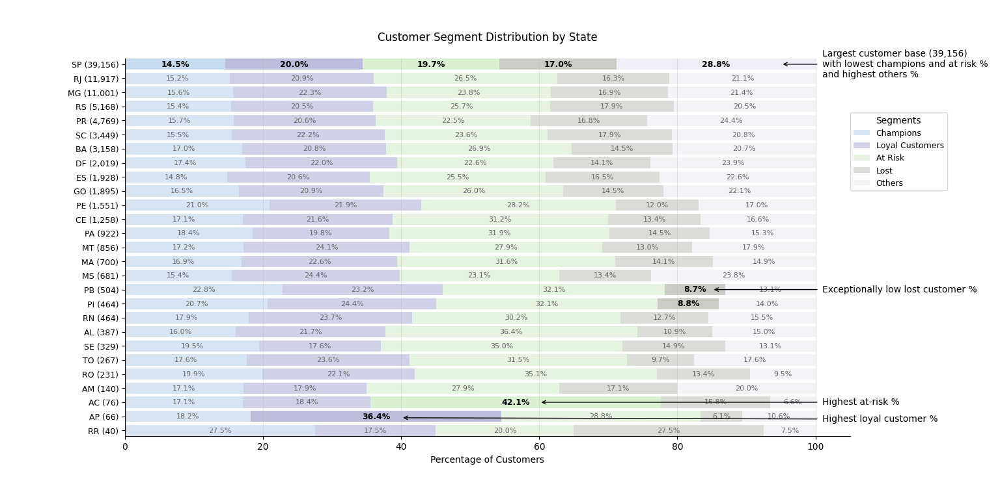
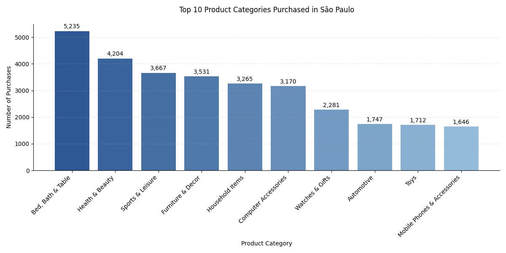
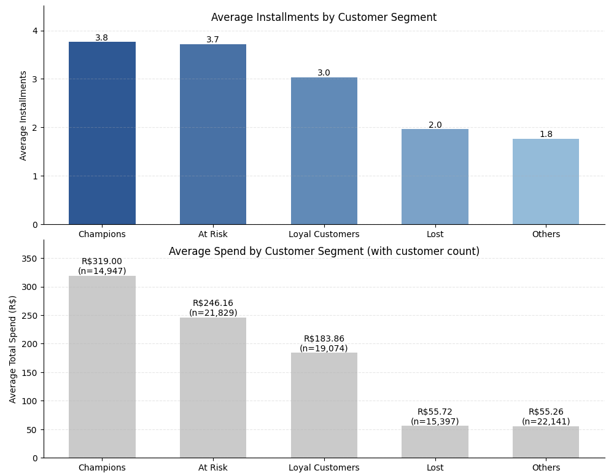

# Data-Driven Market Entry Strategy: Brazilian E-commerce Analysis

## The Challenge
Imagine you're an entrepreneur looking to start an e-commerce business in Brazil. You have access to Olist, Brazil's leading marketplace platform (think Brazilian Amazon), but where do you begin? Which products should you sell? Where should you focus your efforts? How can you identify and retain the most valuable customers?

This project transforms raw e-commerce data into actionable insights, creating a data-driven roadmap for successful market entry.

## The Solution
Using Python, PostgreSQL, and Claude 3.5 Sonnet (Anthropic's latest AI model), I analyzed Olist's marketplace data to develop evidence-based strategies for new sellers. The analysis encompasses:
- Geographic market opportunities across 28 Brazilian states
- Customer behavior patterns from 96,097 unique customers
- Product performance across major categories
- Payment preferences and their relationship to customer retention

## Key Discoveries

### 1. The Power of Location


The data revealed that:
- São Paulo generates 1,455 repeat purchases - more than any other state
- 13 states show high purchase frequency but lower volume - perfect for targeted expansion
- Some states require 2.5x more time between purchases than others

### 2. Customer Segments that Matter


Using RFM (Recency, Frequency, Monetary) analysis, we identified:
- Five distinct customer segments from Champions to At-Risk
- Regional variations in customer loyalty
- Early warning signals for customer churn

### 3. Winning Product Categories


Not all products are equally valuable. The data showed:
- "Bed, Bath & Table" dominates the market
- Strong performance in "Health & Beauty"
- Clear hierarchy in category preferences

### 4. The Payment Patterns that Predict Success


A surprising discovery: payment behavior predicts customer lifecycle:

- We see a clear correlation between installment usage and customer value with one exception: the At-Risk group
- Champions average 3.8 installments per purchase, while At-Risk customers average 3.7
- This similar installment usage suggests At-Risk customers are stretching their finances to maintain Champion-level purchasing
- These payment patterns serve as early warning signals for potential customer churn
- The data provides opportunities for early intervention before customers become inactive

## Strategic Recommendations

### 1. Market Entry Strategy 🎯
- Begin with São Paulo - the data shows it's Brazil's strongest e-commerce market
- Focus initially on "Bed, Bath & Table" category - proven demand and strong margins
- Plan controlled expansion into "Health & Beauty" after establishing market presence
- Build robust infrastructure for installment payment processing from day one

### 2. Customer Retention Playbook 🔄
- Implement early warning system based on installment usage patterns
- Develop segment-specific marketing approaches
- Create loyalty programs rewarding consistent purchasing
- Monitor payment behavior for signs of financial stress

### 3. Growth Strategy 📈
- Establish strong presence in São Paulo before expanding
- Target high-frequency states for second phase growth
- Customize approach based on regional payment preferences
- Focus marketing spend on proven customer segments

## The Impact
This analysis transforms raw data into actionable strategy, providing entrepreneurs with:
- Evidence-based market entry roadmap
- Customer retention tactics backed by behavioral data
- Risk management framework using payment patterns
- Clear metrics for measuring success

## Technical Highlights
- Advanced SQL with window functions and CTEs
- RFM customer segmentation
- Geographic market analysis
- Time series analysis of purchase patterns
- Payment behavior analysis

## Tools & Technologies Used
- Python (Pandas, Matplotlib, Seaborn)
- PostgreSQL (Complex queries, Window functions)
- Claude 3.5 Sonnet for AI-augmented analysis
- Data Visualization Libraries
- RFM Analysis Techniques
  
## Project Structure
```tree
olist-analysis/
├── README.md
├── ANALYSIS.md
├── requirements.txt
├── images/
│   ├── state_performance_quadrants.png
│   ├── customer_segments_by_state.png
│   ├── sp_top_categories.png
│   └── installments_by_segment.png
└── src/
    ├── utils.py
    ├── performance_quadrant.py
    ├── segments_by_state.py
    ├── sp_top_categories.py
    ├── installments_by_segment.py
    └── schema.sql
```

For detailed analysis methodology and findings, see `ANALYSIS.md`.

## Contact
For collaboration opportunities, please reach out via symmetry1@live.com

© 2025 Heath Hoppus

## License
This project is licensed under the MIT License - see the LICENSE file for details.